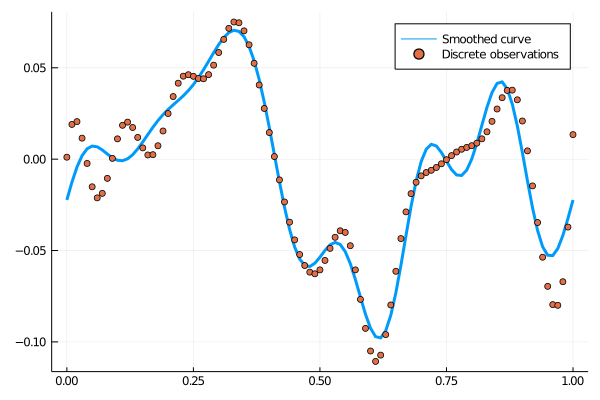

# FDA.jl - Functional Data Analysis

The goal of this package is to provide a comprehensive collection of tools for functional data analysis (FDA).

So far this package is still under active development, and it supports two types of basis functions: B-Spline and Fourier.

It can generate basis functions, smooth discretely observed functions with specified basis functions, and evaluate functional objects on given girds.

The example [test/runtests.jl](test/runtests.jl) demonstrates the usage and produces the following output:

## Acknowledgments

This package is inspired by *Functional Data Analysis* by Bernard Silverman and James O. Ramsay and their `R` package `fda`.
